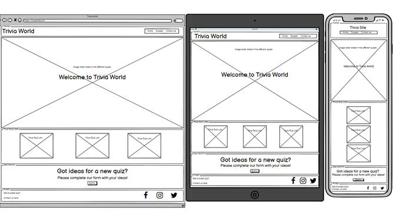
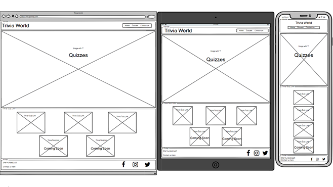
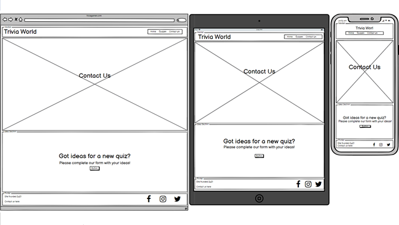

# Trivia World Website

## Interactive Front-End Development

---

(Add screenshot of responsive design when site is complete)

This site has been created and designed for the user to test their knowledge on different subjects, relax and have a little fun. The aim is to provide the user with a visually pleasing and fluid design throughout with responsive elements to aid the users experience.

---
---

## Table of contents

---

- [UX](#ux)
    - [Project Goals](#project-goals)
    - [User Goals](#user-goals)
    - [User Stories](#user-stories)
    - [Wireframes](#wireframes)
    - [Surface](#surface)
- [Features](#features)
    - [Navigation Bar](#navigation-bar)
    - [Home Page](#home-page)
    - [Quizzes Page](#quizzes-page)
    - [Contact Us Page](#contact-us-page)
    - [Footer](#footer)
- [Technologies Used](#technologies-used)
- [Testing](#testing)
    - [Functionality Testing](#functionality-testing)
    - [Compatibility Testing](#compatibility-testing)
    - [User Story Testing](#user-story-testing)
    - [Issues and Bugs](#issues-and-bugs)
    - [Performance Testing](#performance-testing)
    - [Code Validation](#code-validation)
- [Deployment](#deployment)
- [Credits](#credits)
    - [Learning resources and styling ideas](#learning-resources-and-styling-ideas)
    - [Code](#code)
    - [Images Used](#images-used)
- [Other Information](#other-information)
- [Project Screenshots](#project-screenshots)

---
---

## UX

---

### Project Goals

The primary goal of the Trivia World website is to provide a site where users can visit to test their knowledge on subjects to relax and have fun. The website will therefore have a welcoming, consistant and soft feel to it for the design choices and colours picked.

### User Goals

#### User goals:

* User can easily navigate to quizzes.
* User finds the site relax with a soft feel.
* User has the option to submit ideas for new quizzes.

### User Stories

#### As the site owner I would like:

* To provide a relaxing and easy to use website which allows the user to test their knowledge on subjects.
* Be contacted about new quiz ideas.

#### As a new user to the site:

* I would like to test my knowledge on different subjects.
* Relax and unwind whilst having fun.
* Contact the owner about new ideas for quizzes.

### Wireframes

I used [balsamiq.com](https://balsamiq.com/) to create the wireframes.

Home Page

Quizzes Page

Contact Us Page

### Surface

#### Colours

#### Fonts

* Primary font - 'Nunito' was chosen as the charecters apear soft in the way the round at every end.
* Secondary font - 'Lato' was chosen as this is a clear font and will be used for questions and answers so the users will not struggle to read it.
* Back-up font - 'sans-serif' chosen as a back-up font as it's a standard universal font.

#### Images

Back to [Table of Contents](#table-of-contents)

## Features

---

### Navigation Bar
### Home Page
### Quizzes Page
### Contact Us Page
### Footer
## Technologies Used
## Testing
### Functionality Testing
### Compatibility Testing
### User Story Testing
### Issues and Bugs
### Performance Testing
### Code Validation
## Deployment
## Credits
### Learning resources and styling ideas
### Code
### Images Used
## Other Information
## Project Screenshots